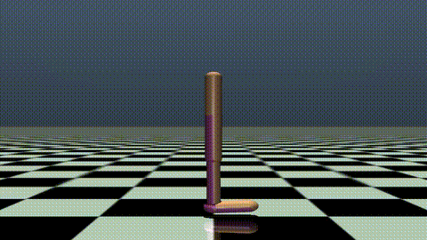

# RL_work
Implementation of SOTA RL algortihms for solving open-ai gym environments. 

Latest additions: Ant-v4, halfcheetah-v4, hopper-v4. All these are continuous environments and were easily solved using Proximal Policy Algorithm [Schulman Et al]

